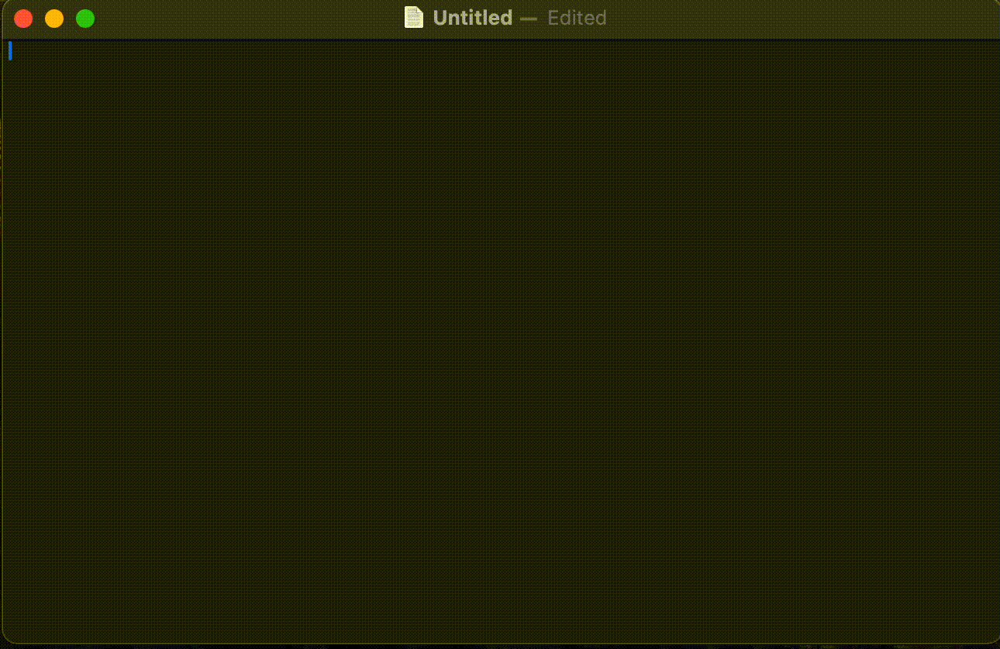

# Raelize
[Click here to read the commentary article(JP).](https://www.tatsumi0000.com/posts/2024/04/19/developed-english-ime-raelize-runs-on-mac/)

Raelize is macOS IME tool for English. This is a coined word combining realize(気付く), æ, and aspect(両面) 🫰


<p align="center">

</p>


# How to use?

**There are a lot of bugs, so be careful!**

## Use fastlane
After executing the following command, try from step 3.

```sh
bundle install
bundle exec fastlane app_build
```

## Manual(operation)

1. Build with Xcode.
2. Copy Raelize.app to `~/Library/Input\ Methods/`.
3. Open macOS preferences and add Raelize as an input source.
4. Enter text after selecting Raelize.

# 🧑‍💻Setup(for developers)

1. Clone this repository.

```sh
git clone https://github.com/Tatsumi0000/Raelize.git
```

2. Create `Signing.xcconfig` file and write your settings.

```xconfig
cp example-Signing.xcconfig Signing.xcconfig
```

3. Formatter settings.

```sh
git config --local core.hooksPath .githooks
chmod +x .githooks/pre-commit
```

# 📗Modules

Raelize is a multi-module configuration using Swift Package Manager. Each module is described below.

## Raelize

Main app.

## RaelizeDebug

IMEKit is difficult to verify, so we use SwiftUI's TextField to reproduce it.

## RaelizeLogic

WordList and word search algorithm (binary search).

## RaelizeInputMethodKit

IMEKit module.
